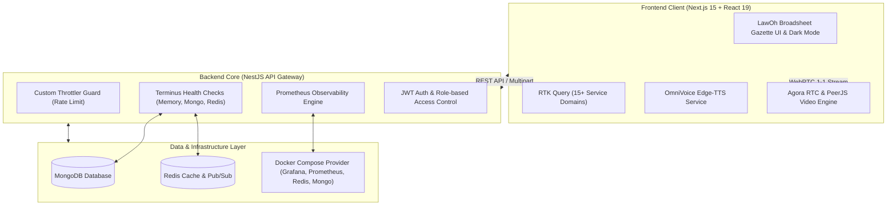

<div align="center">

# ⚖️ LAWOH — LEGALTECH ECOSYSTEM
### Nền Tảng Công Nghệ Pháp Lý Toàn Diện & Tư Vấn Trực Tuyến Thế Hệ Mới

[-000000?style=for-the-badge&logo=nextdotjs&logoColor=white)](https://nextjs.org/)
[](https://react.dev/)
[](https://nestjs.com/)
[](https://redux-toolkit.js.org/)
[](https://www.typescriptlang.org/)
[](https://www.docker.com/)

<p align="center">
  <b>LawOh</b> kết nối trực tiếp công dân, doanh nghiệp với các Luật sư chính quy trên toàn quốc, tích hợp phòng tư vấn Video Call 1-1 mã hóa, trợ lý AI tổng hợp giọng nói OmniVoice/TTS, quản lý hồ sơ & biểu mẫu pháp lý chuẩn, và trung tâm kiểm duyệt bản tin án lệ.
</p>

</div>

---

## 🏛️ 1. Kiến Trúc Tổng Thể Hệ Thống (System Architecture)



---

## ✨ 2. Tính Năng Nổi Bật (Key Features)

### 🧑‍⚖️ 1. Danh Bạ & Hồ Sơ Luật Sư Toàn Quốc
- Tra cứu danh bạ luật sư theo đoàn luật sư, tỉnh/thành phố, số năm kinh nghiệm, xếp hạng uy tín.
- Quy trình nộp hồ sơ xin cấp quyền Luật sư và xác minh nghiệp vụ chặt chẽ bởi Quản trị viên.

### 📅 2. Đặt Lịch & Tư Vấn Trực Tuyến 1-1
- Hệ thống đặt lịch thông minh phân tách thời gian biểu của khách hàng và luật sư.
- Tích hợp **Video Call thời gian thực** bảo mật cao hỗ trợ bởi **Agora RTC** và **PeerJS**.

### 📰 3. Tòa Soạn Bản Tin Pháp Lý & Án Lệ (Gazette Broadsheet)
- **Trình soạn thảo Block-based Editor**: Cho phép biên soạn bài viết phân đoạn (Tiêu đề, Đoạn phân tích, Trích dẫn án lệ, Hình ảnh tài liệu minh họa).
- **Quy trình Kiểm duyệt 2 chiều (Moderation Lifecycle)**:
  - Luật sư gửi bài -> Admin phê duyệt hoặc từ chối kèm lý do (`rejectReason`).
  - Luật sư sửa đổi & nộp lại (`Resubmit`) bài viết bị từ chối linh hoạt.

### 📁 4. Kho Biểu Mẫu & Đọc Tài Liệu Trực Tuyến
- Tải về và xem trước trực tiếp tài liệu định dạng `.docx` chuẩn mẫu quy định Tòa án và Bộ Tư pháp.
- Tìm kiếm nhanh theo lĩnh vực: *Dân sự, Hình sự, Đất đai, Hôn nhân gia đình, Lao động, Doanh nghiệp, Bảo hiểm*.

### 🔊 5. Trợ Lý Giọng Nói AI (OmniVoice / TTS)
- Tích hợp dịch vụ đọc văn bản pháp luật và tóm tắt bản tin thời sự pháp lý bằng giọng nói tự nhiên thông qua Python OmniVoice / Edge-TTS.

### 🛡️ 6. Cổng Quản Trị Trung Tâm (Admin Portal)
- Dashboard quản trị toàn diện: Quản lý người dùng, duyệt luật sư, kiểm duyệt video, kiểm duyệt bài viết, theo dõi giao dịch & biểu phí, thiết lập bảng giá thị trường.

---

## 🛠️ 3. Công Nghệ Sử Dụng (Tech Stack)

| Lớp (Layer) | Công nghệ | Mục đích |
| :--- | :--- | :--- |
| **Frontend Framework** | **Next.js 15.2 (App Router) + React 19** | Server Components, tối ưu SEO, tốc độ tải trang cao |
| **State & API Management** | **Redux Toolkit & RTK Query** | Quản lý state tập trung, tự động cache & invalidate tags |
| **Styling & UI System** | **Tailwind CSS + HeroUI + Lucide** | Giao diện Gazette Broadsheet tùy biến, hỗ trợ Dark/Light mode |
| **Realtime & Video Stream** | **Agora RTC SDK + PeerJS + Socket.IO** | Video call 1-1, trao đổi tin nhắn và thông báo tức thời |
| **Backend Core** | **NestJS + TypeScript** | Kiến trúc module doanh nghiệp, phân tách `libs/` dùng chung |
| **Database & Cache** | **MongoDB (Mongoose) + Redis** | Lưu trữ dữ liệu quan hệ/tài liệu và lưu đệm tốc độ cao |
| **DevOps & Monitoring** | **Prometheus + Terminus + Docker** | Giám sát chỉ số tài nguyên, kiểm tra liveness/readiness |
| **Code Quality & CI/CD** | **Husky + Commitlint + ESLint** | Chuẩn hóa Conventional Commits và kiểm tra kiểu dữ liệu tự động |

---

## 🔌 4. Bản Đồ Cổng Dịch Vụ (Port Map)

| Dịch vụ | Địa chỉ truy cập | Ghi chú |
| :--- | :--- | :--- |
| **Frontend Web App** | `http://localhost:3002` | Cổng Next.js Client |
| **Backend REST API** | `http://localhost:3300/api/v1` | Cổng chính NestJS API |
| **OmniVoice TTS Service** | `http://localhost:8000` | Dịch vụ chuyển văn bản thành giọng nói Python |
| **MongoDB** | `localhost:27017` | Cơ sở dữ liệu chính |
| **Redis** | `localhost:6379` | Cache & Session Store |
| **Prometheus Metrics** | `http://localhost:3300/metrics` | Thu thập chỉ số hiệu năng |
| **Grafana Dashboard** | `http://localhost:3001` | Trực quan hóa hệ thống |

---

## ⚙️ 5. Hướng Dẫn Cài Đặt & Khởi Chạy

### 1. Cấu hình Biến Môi trường (.env)

Tạo file `.env.local` tại thư mục gốc `LawohFe`:

```env
NEXT_PUBLIC_API_URL=http://localhost:3300/api/v1
NEXT_PUBLIC_SOCKET_URL=http://localhost:3300
NEXT_PUBLIC_CLIENT_URL=http://localhost:3002
```

### 2. Cài đặt Thư viện

```bash
# Cài đặt dependencies cho Frontend
npm install
```

### 3. Chạy Môi trường Phát triển (Development)

```bash
# Khởi chạy đồng thời Next.js App (Port 3002) và OmniVoice Service
npm run dev

# Hoặc chỉ chạy riêng Next.js
npm run dev:next
```

Mở trình duyệt và truy cập: **[http://localhost:3002](http://localhost:3002)**

### 4. Kiểm tra Lỗi & Build Production

```bash
# Kiểm tra TypeScript type checking
npx tsc --noEmit

# Kiểm tra cú pháp commitlint
npx commitlint --from=HEAD~1

# Đóng gói ứng dụng cho môi trường production
npm run build
```

---

## 🎨 6. Ngôn Ngữ Thiết Kế: LawOh Broadsheet Gazette

1. **Bảng màu Biên tập Cổ điển (Editorial Palette)**:
   - Nền sáng: `#faf6ee` (Parchment Paper) / Nền tối: `#16130e` (Obsidian Ink).
   - Màu điểm nhấn chủ đạo: `#1a5336` (Forest Green - Thượng tôn Pháp luật) & `#d95327` (Terra Cotta - Bản tin án lệ).
2. **Kiểu chữ (Typography)**:
   - Tiêu đề: Font Serif trang trọng, đậm nét báo chí chính luận.
   - Nội dung & Metadata: Font Sans kết hợp Mono hiển thị mã hiệu văn bản, ngày ban hành và trạng thái kiểm duyệt.
3. **Đường nét & Đổ bóng (Brutalist Hairline Borders)**:
   - Sử dụng viền đôi `border-2 border-stone-800` kết hợp bóng cứng `shadow-[4px_4px_0px_#000]` tạo cảm giác đanh thép, rõ ràng và minh bạch.

---

## 📜 7. Quy Chuẩn Đóng Góp & Commit (Git Convention)

Dự án áp dụng chặt chẽ **Conventional Commits** qua `Husky` + `Commitlint`:

- `feat:` Thêm tính năng mới (ví dụ: `feat: add resubmit rejected news workflow`)
- `fix:` Sửa lỗi hệ thống (ví dụ: `fix: multipart image field name for multer`)
- `docs:` Cập nhật tài liệu kỹ thuật hoặc README
- `refactor:` Tái cấu trúc mã nguồn nhưng không đổi nghiệp vụ
- `perf:` Tối ưu hiệu năng, giảm độ trễ
- `chore:` Cập nhật dependencies, cấu hình tooling

---

## 📄 8. Bản Quyền & Giấy Phép

Bản quyền © 2026 **LawOh Vietnam** — Toàn quyền bảo lưu.
Phát triển bởi đội ngũ Kỹ sư Công nghệ Pháp lý LawOh.
